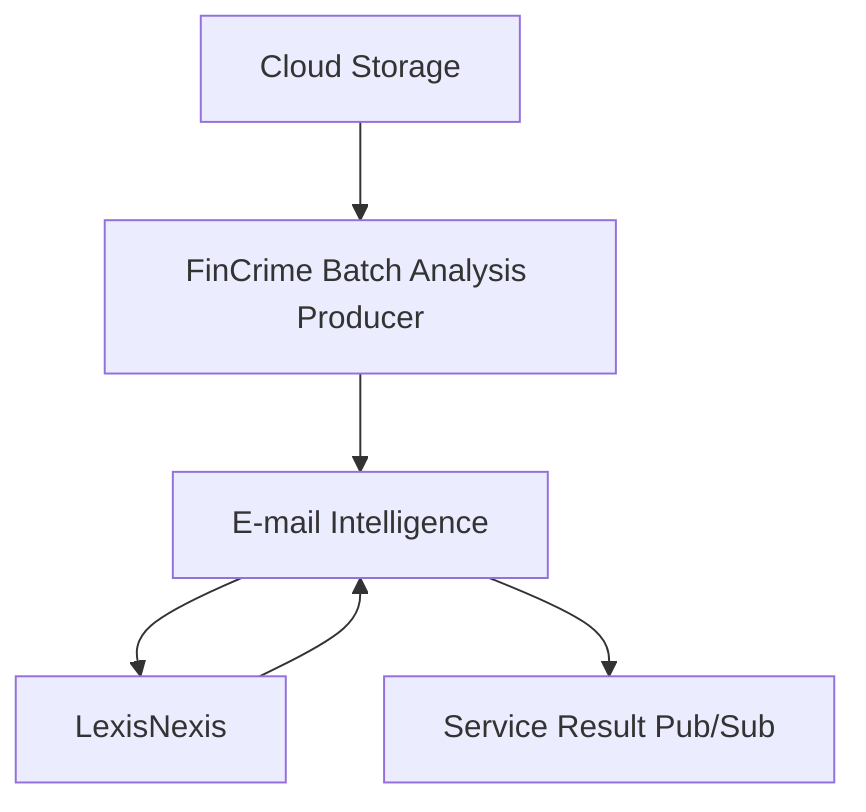

# Fincrime Analysis Producer
This repository is a microservice for Batch Fraud Analysis Producer.

## Purpose
This application receives files with customer IDs and triggers fraud analysis in Email-Intelligence for the IDs included in the file.

## Datadog Dashboard
Coming soon

### Monitors
Coming soon

### Health Check
https://fc-analysis-producer-default.{env}.q3.questech.io/healthz

## Service and Dependencies


## Team Contact Information
Slack Channel: #team-tmj

Alerts Channel: #fincrime-fraud-aml-alerts

Email group: questrade-scrumteam-tmj@questrade.com

### Running Unit Test
```
dotnet test src/Questrade.FinCrime.Analysis.Producer.Tests.Unit/Questrade.FinCrime.Analysis.Producer.Tests.Unit.csproj
```

### Running Integration Tests
Before executing the integration tests locally you will need to execute the following command in terminal:
```
docker-compose -f ./docker/dev-environment/docker-compose.yml up -d
```

This will create and run one container in background:
- analysis-producer-pubsub-emulator

Our integration tests will use this emulator to create our temporary topics, subscriptions and to publish any necessary messages to the tests, in a safe and controlled local environment.

Once the emulator is running, run the following command
```
dotnet test src/Questrade.FinCrime.Analysis.Producer.Tests.Integration/Questrade.FinCrime.Analysis.Producer.Tests.Integration.csproj
```

# More information
-   LexisNexis is a Questrade's partner who delivery information about customer's email.
-   E-mail Intelligence is a internal application who will be triggered by fc-analysis-producer.
-   Service Result Pub/Sub the will receive a message from FinCrime intelligences.
-   [Sonarqube - fc-analysis-producer](https://sonarqube.questrade.com/dashboard?id=fc-analysis-producer)